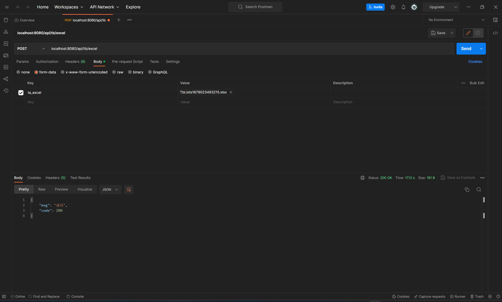

[TOC]


（以下返回“成功”时都查询数据库表验证了数据变更的正确性）

## TableA（ta)

### TableA 新增功能：


### TableA编辑功能：


### TableA删除功能：


### TableA 导入功能：

将20000条随机数据导入A表，消耗10.62s，在service层循环insert很慢，需要优化。（这是没有在插入时立刻更新B表对应字段）


---

### 按字段“A”模糊查询：


---


## TableB（tb）

### TableB 新增功能：


### TableB 编辑功能：


### TableB 删除功能：


删除不存在对象，返回删除对象不存在的错误信息。


### TableB 导入功能：

导入两万条数据到B表，在每次插入时更新B表需要计算的字段，消耗4分18秒，有点抽象 ：）

因为在B表service层的insertTb()方法下面加了calculateTb()的方法，所以还执行了两万次update，每个update还需要联合A表计算，耗时太多。


### TableB 导出功能：

导出两万条数据消耗约1.9s。


### TableB 按字段C一键删除：

删除字段C为“B"的记录，两万条记录中删除了10046条记录。


---

## TableC（tc）

### TableC 一键计算功能：


​	

### TableC 导出功能：


### TableC 按字段“B”模糊查询：


## 一些优化（后面的优化在保留前面优化的基础上进行）

### 把 calculateTb()从每个insert和update之后移动到导出B表以及一键计算Tc之前。

导入B表用时由**4m18s**降低为**17s**。



**导出B表**用时由**1.90s**延长为**4.12s**


一键计算C表用时由**318ms**延长至**772ms**。


*整体来讲性能得到极大优化。*


### 将for循环放到SQL语句中以优化导入性能

这里出现报错，代码和错误信息如下：

```xml
    <sql id="TaFields">
        a,b,c,d,e,f,aa,bb,cc,dd,ee
    </sql>
    <insert id="batchInsertTa" parameterType="Ta">
        INSERT INTO TA(<include refid="TaFields"/>)
        VALUES
        <foreach collection="list" item="item" separator=",">
            (#{item.a},#{item.b}, #{item.c}, #{item.d}, #{item.e},#{item.f}, 
             #{item.aa},#{item.bb}, #{item.cc},#{item.dd},#{item.ee})
        </foreach>
    </insert>
```

```
### Error updating database.  Cause: java.sql.SQLSyntaxErrorException: You have an error in your SQL syntax; check the manual that corresponds to your MySQL server version for the right syntax to use near '' at line 4
### The error may exist in file [D:\IDEA_Projects\data-api\target\classes\mapper\ta-mapper.xml]
### The error may involve com.minton.dataapi.dao.TaMapper.batchInsertTa-Inline
### The error occurred while setting parameters
### SQL: INSERT INTO TA(          a,b,c,d,e,f,aa,bb,cc,dd,ee      )         VALUES
### Cause: java.sql.SQLSyntaxErrorException: You have an error in your SQL syntax; check the manual that corresponds to your MySQL server version for the right syntax to use near '' at line 4; bad SQL grammar []] with root cause
```

最后发现问题是：改为传入一个list后，出现了恰好传完全部Ta最后再传入一个空list的问题，因为这里在TableReadListener中有

```java
@Override
public void doAfterAllAnalysed(AnalysisContext context) {
    // 这里也要保存数据，确保最后遗留的数据也存储到数据库
    // 但是最好判断是否为空list
    if(cachedDataList.size() > 0){
        saveData();
    }
    log.info("所有数据解析完成！");
    System.out.println("所有数据解析完成！");
}
```

原本没有问题是因为在service层拿到这个cashedDataList 然后 for 循环 insert所以相当于判了空。所以其实还是在service层拿到list进行判空再batchInsert也是可以的。但是感觉在这个doAfter里面加判断更加合理，且只需要加一次。

修复后，

A表导入用时由**10.62s**降低到**3.19s**


B表导入用时从**17s**进一步降低为**3.19s** ，性能提升显著。


### 将B表切换为MyISAM引擎

B表导入用时从3.19s降低为3.11s，基本没有变化。


### 将sqlSession的ExecutorType设置为Batch

- 在batchInsertTb()中开sqlSession。测试用时4s，性能反而下降

- 全局设置mybatis.executor-type=batch，测试用时约3s，性能有小幅度提升。

  ​	（但其实这里还有每个cachedList的大小问题，没有调整进行测试）

  ​		（补充：进行了测试，cachedList大小为原本的100基本是最优）

  结论是性能基本没有提升。


### 多线程

线程池用一下，配置：

```java
@Configuration
public class ThreadPoolExecutorConfig {
    @Bean
    public ThreadPoolExecutor threadPoolExecutor() {
        //线程池中6个线程，最大8个线程，用于缓存任务的阻塞队列数5个
        ThreadPoolExecutor executor = new ThreadPoolExecutor(6, 8, 5, TimeUnit.SECONDS, new ArrayBlockingQueue<>(100));
        executor.allowCoreThreadTimeOut(true);//允许超时
        return executor;
    }
}
```

```java
@Override
public void batchInsertTa(List<Ta> taList){
    Thread thread = new Thread(new Runnable() {
        @Override
        public void run() {
            try{
                tbMapper.batchInsertTb(taList);
            }catch(Exception e){
                e.printStackTrace();
            }
        }
    });
    try{
        executor.execute(thread);
    }catch (Exception e){
        e.printStackTrace();
    }
```

耗时1.21s，速度显著提升。

修改listener中的BATCH_COUNT = 1000（原为100，即每一百条记录开一个线程调用插入）得到0.91ms插入两万条数据的结果


然后又发现核心线程数最大线程数都设置为1反而可以更快...：0.79s


